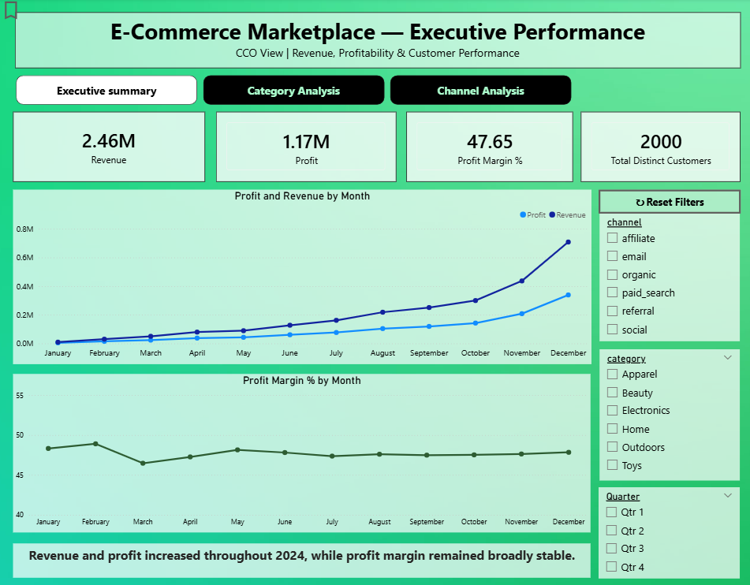
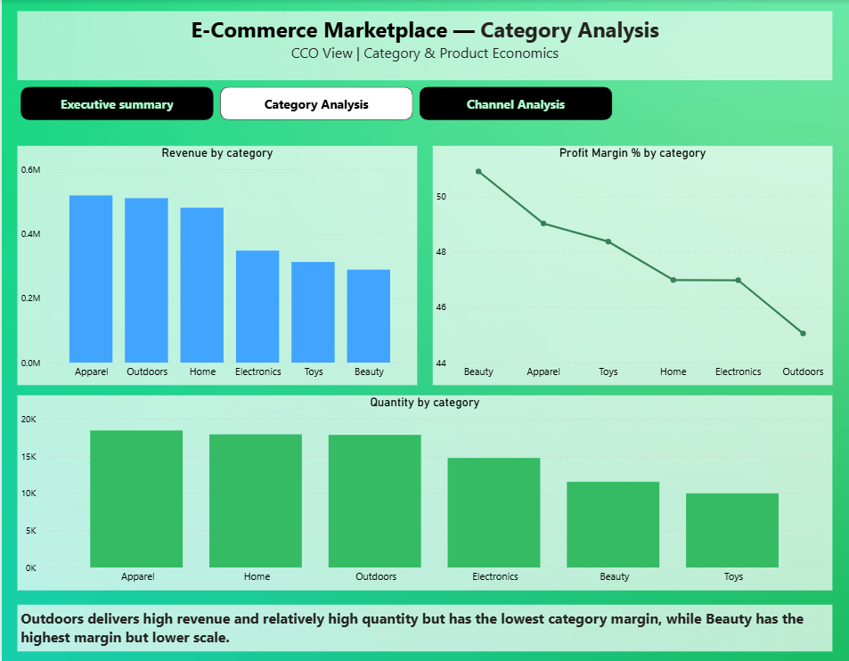
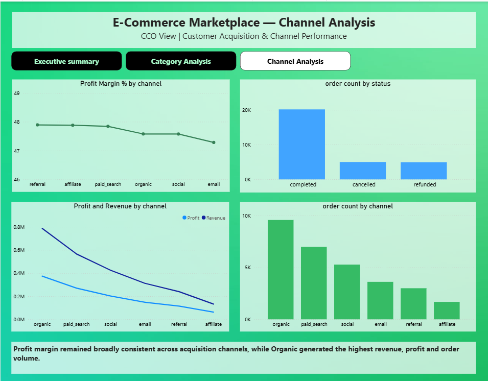

# E-Commerce Marketplace: Commercial Performance Analysis

A business analytics project using **Excel and Power BI (DAX)** to evaluate commercial performance, profitability, category performance, and acquisition-channel trends for a synthetic e-commerce marketplace.

The analysis focuses on understanding whether revenue growth is translating into profitable growth and identifying areas requiring further commercial investigation.

## Business Problem

Revenue growth does not necessarily mean profitable growth.

The objective of this analysis was to help a Chief Commercial Officer (CCO) understand:

- Whether revenue and profit are growing together
- How profitability differs across product categories
- Which products combine high scale with lower margins
- How acquisition channels compare in terms of revenue, profit, and orders
- Where further investigation may be required to improve commercial performance

## Dataset

The project uses a **synthetic e-commerce marketplace dataset** consisting of 5 related tables and approximately **104,000 records**.

| Table | Records |

| Customers | 2,000 |
| Orders | 12,000 |
| Order Items | 30,120 |
| Products | 120 |
| Events | 59,599 |

## Tools & Techniques

- **Excel** — Data preparation and validation
- **Power BI** — Data modelling, dashboard development and visualization
- **DAX** — KPI calculations and analytical measures
- **Business Analysis** — KPI analysis, trend analysis, performance comparison and recommendations

## Data Validation

Before analysis, the dataset was reviewed for data quality and consistency.

- Checked tables for missing values
- Checked for duplicate IDs
- Validated relationships between related tables
- Reviewed order status distribution
- Converted date/time fields to appropriate formats
- Checked that product cost did not exceed catalogue price

### Order Status Distribution

- Completed: **66.8%**
- Cancelled: **16.7%**
- Refunded: **16.5%**

## Business Rules

To ensure the analysis represented realized commercial performance:

- Revenue and profit calculations use **completed orders only**
- Revenue = Quantity × Actual Transaction Price
- Profit = (Selling Price − Product Unit Cost) × Quantity
- Profit Margin = Profit ÷ Revenue × 100

## Power BI Dashboard

The Power BI report contains multiple analytical views:

### Executive Summary
Provides an overview of key commercial KPIs including revenue, profit, profit margin, and customer performance.

### Category Analysis
Compares revenue, profit, quantity, and profit margins across product categories.

### Channel Analysis
Evaluates acquisition channels based on revenue, profit, and order volume.

### Product Detail
Provides product-level analysis and drillthrough for deeper investigation of category performance.

### Monthly Performance
Examines performance trends over time.

**Dashboard filters include:** Channel, Category, and Quarter.

## Key Findings

### 1. Revenue & Profitability

Revenue and profit increased through 2024 while overall profit margin remained broadly stable.

This indicates that the analysis did not identify a sustained company-wide profitability decline.

### 2. Category Performance

**Outdoors** generated the highest revenue but had the lowest category-level profit margin.

In contrast, **Beauty** achieved the highest margin at a lower overall scale.

This suggests that high revenue does not necessarily translate into high profitability.

### 3. Product Performance

Several high-scale products within Outdoors generated substantial profit despite relatively low margins.

Products such as **SKU-0095, SKU-0051, and SKU-0038** were identified for further commercial review.

### 4. Acquisition Channels

**Organic** generated the highest revenue, profit, and order volume.

However, acquisition-channel margins remained broadly comparable, so margin alone was not sufficient to justify reallocating channel budgets.

### 5. Further Investigation

Discount levels were relatively consistent across the available data.

Additional checks by country, channel, and month did not identify a clear driver of the Outdoors margin gap.

The analysis therefore identifies **where performance differs, but not always why**.

## Recommendations

Based on the analysis:

1. Conduct a margin review of the **Outdoors** category, particularly high-scale, lower-margin products.
2. Investigate high-margin products such as **SKU-0022** to identify potential pricing or cost-management opportunities.
3. Avoid making acquisition-channel budget decisions based on margin alone.
4. Incorporate additional marketing metrics such as **spend, CAC, and LTV** for a more complete channel evaluation.

## Limitations

- Marketing spend is not available, so **CAC and LTV cannot be calculated**.
- The Events table does not contain product or order IDs, so events cannot be directly linked to products.
- Profit represents **product-level contribution** based on product cost only.
- Shipping, fulfilment, and marketing costs are not included; therefore, the calculated profit should not be interpreted as net profit.

## Project File

The Power BI report is available in the repository:

[Download the Power BI Report](E-Commerce-Marketplace-Commercial-Performance-Analysis.pbix.pbix)

## Dashboard Preview

### Executive Summary

### Category Analysis

### Channel Analysis

**Built by Kritika Sharma**  
Indore, India | [LinkedIn](https://www.linkedin.com/in/kritika-sharma-a72199235/)
